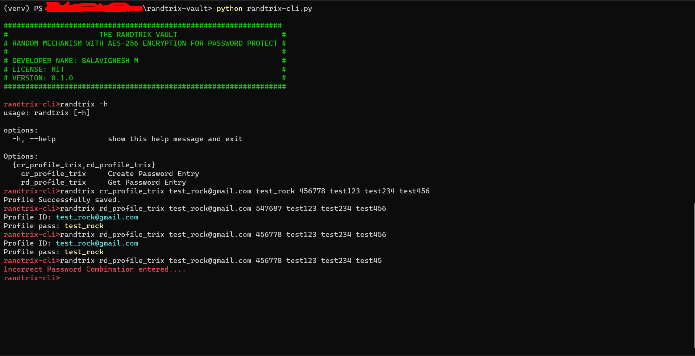

# randtrix-vault
This vault program is used to highly secure the passwords by a combination of mechanisms and the used mechanism for the protection is just a fun idea & strong protection.

## Features
1. Create the profile with a password
2. Read the profile with a password
3. Show all available profile_ids
4. Inbuilt database
5. Steps high secure key generation mechanism
6. Beautiful CLI control

## Installation
1. git clone https://github.com/BALAVIGNESHDOSTRIX/randtrix-vault.git
2. cd randtrix-vault && pip3 install -r requirements.txt
3. python randtrix-cli.py

## Usage
``` 
randtrix-cli> randtrix cr_profile_trix 123@gmil.com test@123 453678 protect1 protect2 protect --tags mail
randtrix-cli> randtrix rd_profile_trix 123@gmil.com 453678 protect1 protect2 protect 
(or)
randtrix-cli> randtrix rd_profile_trix 123@gmil.com 546378 protect1 protect2 protect 
### Show all the profile ids
randtrix-cli> randtrix show_all_profile_ids
(or)
randtrix-cli> randtrix show_all_profile_ids --tags mail
```
## Note
1. In the above example when reading the profile_id(123@gmil.com). you can give the 6-digit random seed (546387 or 453678), every 2 places can be interchangeable (45,36,78) like example when creating 6 digit seed is (453678) = (45,36,78) == (54 or 45, 36 or 63,78 or 87) = 543687.
when reading you can give the following like
546387,
453687,
456387
these combinations are valid for (453678)

2. when reading 3 separate passwords should be the same as used when creating the profile_id

## Console example
 <span/>

## Used ORM (Modified for this project)
https://github.com/fernandojunior/python-sqlite-orm


## Future Release
1. GUI - coming soon

## License
[MIT](https://choosealicense.com/licenses/mit/)